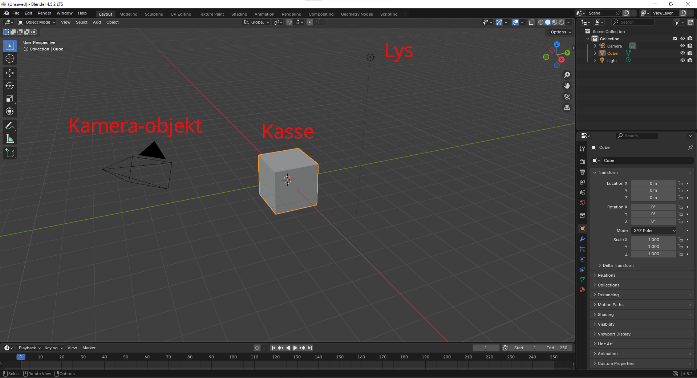
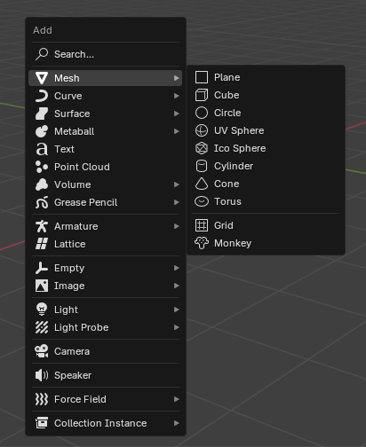
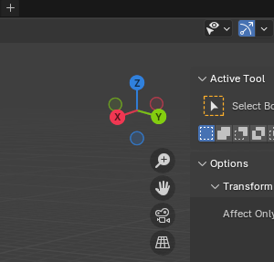
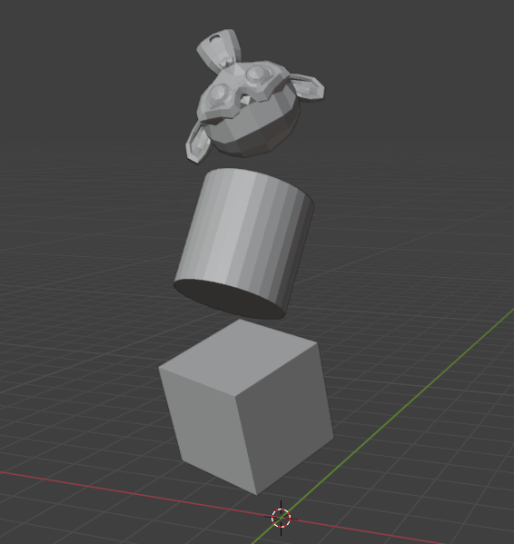

# Opgave 1 - Det vigtigste
Vi starter helt simpelt med at åbne Blender (og du har forhåbentligt installeret Blender, ellers må du lige gøre det), og det første du møder er det her: 

Her har vi tre primære vinduer: Den du vil bruge mest tid på er det store vindue, som bliver kaldt for *3D Viewport*, og er her hvor vi kommer til at arbejde med vores objekter. De to ude til højre er en oversigt over objekter, der er i vores Viewport (øverst til højre), og et vindue til det valgte objekts egenskaber (nederst til højre). Dem bruger vi senere, men i oversigten kan du se at der står "Camera", "Cube", og "Light", og det er de tre objekter som der er i vores Viewport nu.

Det første vi starter med at gøre, er at slette det hele! I 3D Viewport'en, tryk *A* for at vælge alt (eller markér alting med musen), og tryk enten *X* eller *Delete* for at slette dem. 
### Opgave A: Lær kameraet at kende
Vi starter stille og roligt med at lære at bruge kameraet. Prøv følgende:
* Hold musehjulet inde for at rotere kameraet.
* Holder du *Shift* nede på samme tid som musehjulet, flytter man på kameraet i stedet.
* *Ctrl* + musehjulet gør at man flytter kameraet længere væk eller tættere på, men er det samme som at dreje på musehjulet.
* *Alt*+Musehjulet gør, at man skifter mellem nogle udvalgte vinkler når man flytter musen. Det siger nok ikke så meget nu med kassen, men senere kan du prøve det når vi arbejder med andre objekter.

>**Tastetur-kombinationer:**
> Hvis der står noget omkring flere taster + hinanden, betyder det at det er rækkefølgen som man skal trykke tasterne i. For eksempel, hvis der står *Ctrl+Shift+S*, betyder det at man skal trykke på Ctrl/Control, så Shift, og så S.
> Denne kombination gør at man gemmer sin fil, hvilket er en god idé at gøre løbende mens man arbejder med Blender! (dog kan man nøjes med *Ctrl+S* når man har gemt én gang før)

### Opgave B: Tilføj objekter
Efter at have lært at bruge kameraet, kan du begynde at tilføje nogle objekter. Det sker ved at trykke *Shift+A* og derefter holde musen over *Mesh*, og så kommer følgende menu frem:

Dem man kommer til at bruge mest er (sandsynligvis, men ikke altid) *Cube*, *UV Sphere*, og *Cylinder*. Det er dog mest fordi de er nemme at arbejde med, og lave om til andre ting, så lige nu kan du sagtens vælge Monkey.
### Opgave C: Flyt objekter rundt
Nu skal vi begynde at flytte på objekterne! Klik på hvad end du har tilføjet og prøv at lege rundt med de følgende kommandoer:
* **G - Move:** Flyt rundt på objekterne
* **R - Rotate:** Drej objekterne om sig selv
* **S - Scale:** Gør objekter størrere eller mindre

Når man bevæger noget i Blender, kan man også trykke på nogle andre knapper for at gøre noget bestemt. Klikker man på X, begynder man kun at bevæge/rotere/skalere i X-aksen (den røde streg i viewporten). Det samme kan man gøre for Y og Y-aksen (den grønne linje) , og for Z og Z-aksen. Dette kan også ses på oversigten over akserne oppe i højre hjørne.

Nu kan du prøve at flytte rundt på dine objekter, og prøv at tilføje nogle flere og stable dem på hinanden ligesom på billedet. Prøv at leg lidt rundt med det!

Nu når du har lært at flytte kameraet, tilføje objekter og flytte rundt på dem, så kan du gå videre til næste opgave, [Opgave 2 - Bunke af kanonkugler](02-cannonballs)
